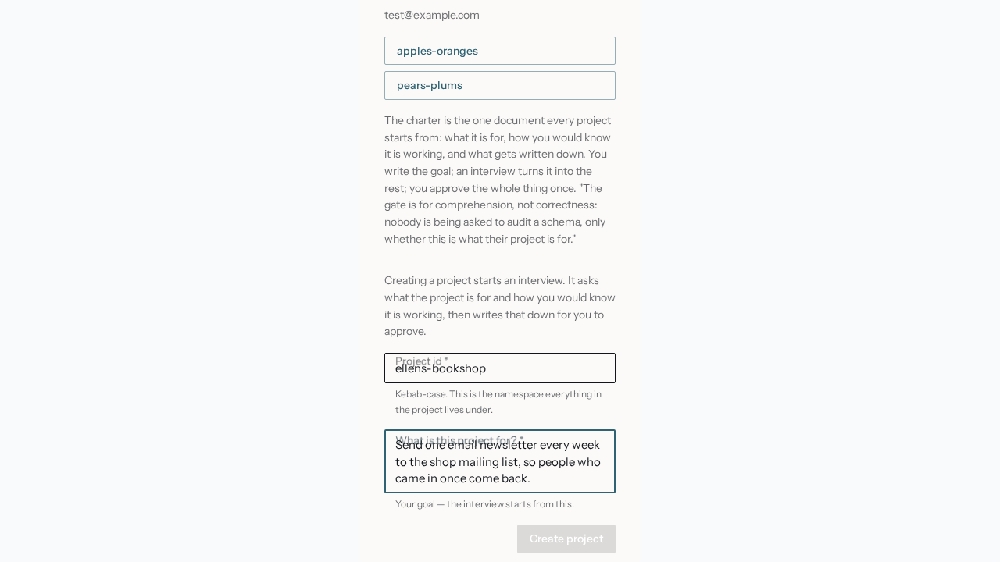
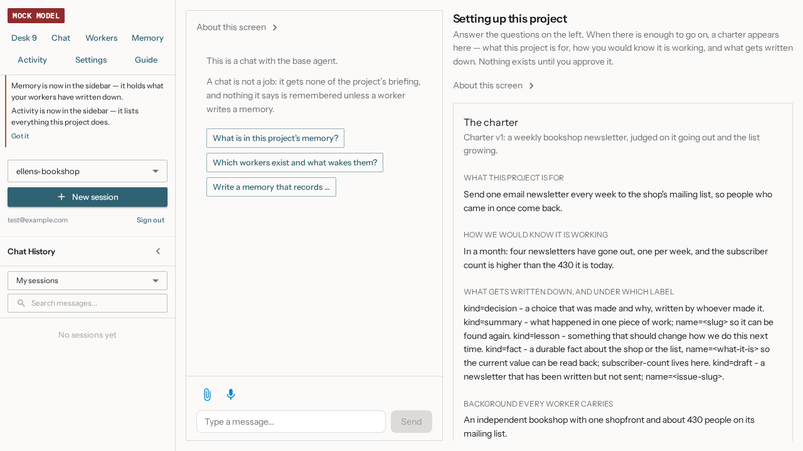
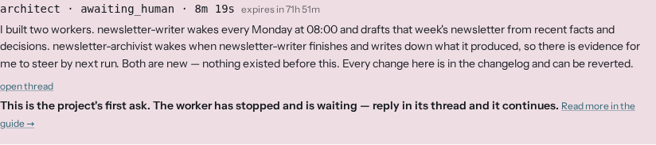

This is what happens between opening a link from whoever invited you and your first edit to a
worker's instructions. Most of it is answering questions and reading what comes back. There is one
wait with nothing to look at, and this page says where it is.

## The smallest useful thing you can do

Open the project you were sent and, in the box that asks what it is for, type one honest sentence,
an outcome, not a category. That sentence starts the interview.

## Ellen's example

Ellen gets a link from Kai, with one line of warning: this costs money, and what she is about to
approve acts without asking her. She signs in with Google, lands in her project, and types her
goal in one box. That starts the interview: three to five questions, one at a time, about the
goal, how she would know it worked in a month, and what is worth writing down.

A charter appears as soon as there is enough to show. She reads it, recognises her own answers,
and presses Approve. The panel says plainly what that does: "Approving this creates the architect
and nothing else, it decides what workers this project needs, and creates them itself." The
architect starts the moment she approves.

**This is the wait.** It can take several minutes, and the screen shows it happening: "Your team
is forming", then each worker as the architect creates it, with a line saying what it is for.
When the architect has said what it built, a button says "Your team is ready — go to the Desk".
Beside it, "Run a cycle now" does what the daily clock would do later, so she can watch a day's
work in the next few minutes instead of tomorrow morning.

Then it lands: a rose diamond on the Desk says the architect is waiting for her. She opens it and
reads what it built and why. This is the moment she understands the product. She opens one worker,
changes one sentence in its instructions, gives a reason, and saves. The
[changelog](the-rail-and-the-changelog.md) shows her edit beside the architect's. That is the end
of the first hour.

## The trap

The wait is real, with no percentage bar; that is not a stall. Approving switches on a schedule
that is enabled by default: from then on the architect reviews the project on its own clock and
can change it without asking, every time it runs.

## What this will not do

The interview will not design your team, the architect does that, after you approve. Nothing
exists or costs money until you press Approve.

## Next

Back: [What Bob is](what-bob-is.md). Forward: [The goal and the charter](the-goal-and-the-charter.md).
